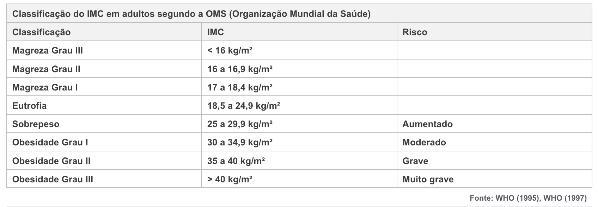

# DESAFIO 02 - 18/FEV

**Objetivo:**  
Escreva um programa que calcula o IMC (Índice de massa corporal de uma pessoa) e exibe o resultado.
  
**Resultado esperado:**
  
```text
Informe sua altura: 1,75
Informe seu peso: 85

> Seu IMC é 27.76
> Sobrepeso
> Obesidade Grau I
> Risco: Aumentado
```


